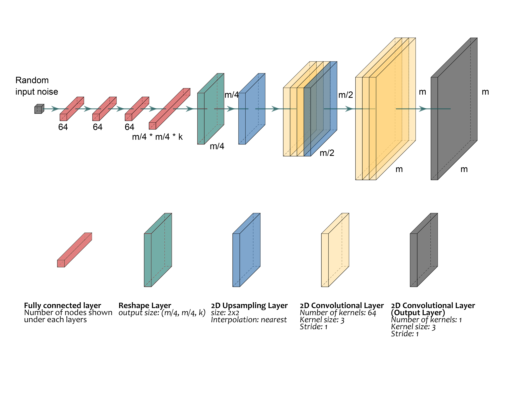
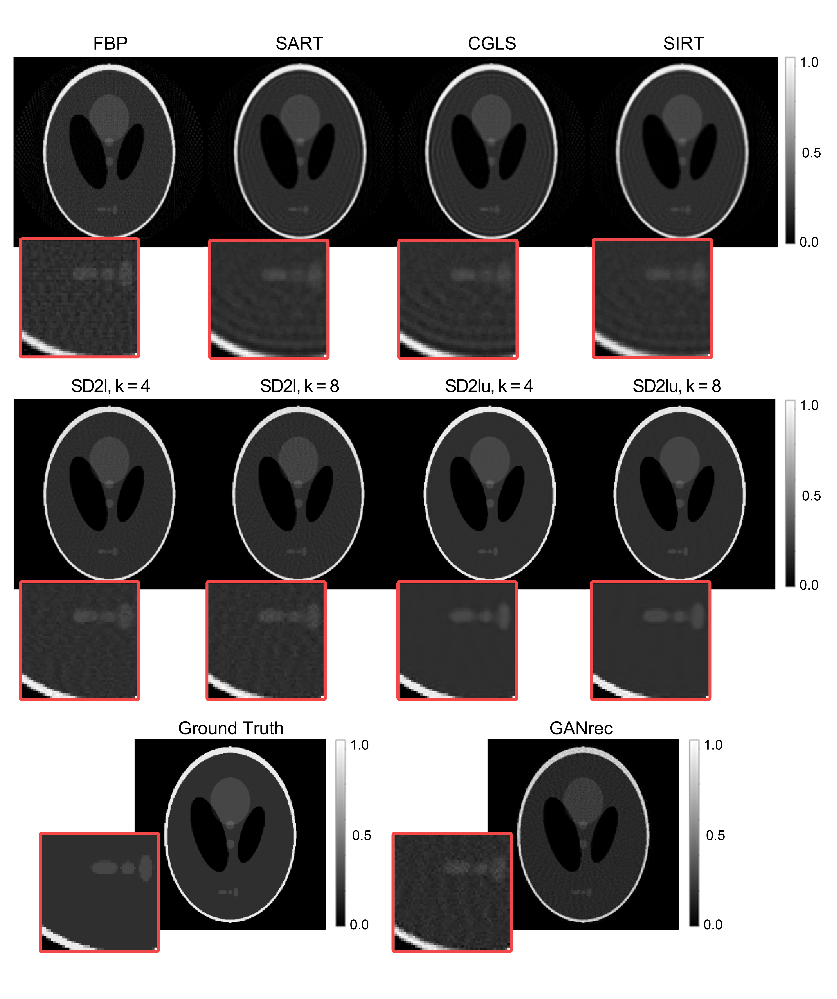

# SD2I
The Single Digit to Image (SD2I) tensorflow-based image reconstruction tool.

To install from git:

```
git clone https://github.com/robindong3/SD2I.git && cd SD2I
pip install -e .
```

Please follow the example scripts in /example folder to reproduce the figures used in the paper

Colab version are also provided, please click on the colab link provided inside each example file.

This package contains only necessary nDTomo functions for using SD2I

For all CT image reconstruction tools please see our nDTomo package: https://github.com/antonyvam/nDTomo.git
## SD2I Reconstruction Loop


**Fig. 1** The flowchart of the SD2I training algorithm. The input of the SD2I is a random constant which preferably has a similar order of magnitude as the reconstructed image's signal. The generator generates an image based on the single input; the generated image is then converted into a sinogram by the forward operator, which is compared with the sinogram from the experimental dataset. The weights of the generator are updated by minimising the joint loss function with mean absolute error (MAE) and structural similarity index measure (SSIM).

## CNN Reconstruction Architecture: SD2Iu


**Fig. 2** A representation of the CNN reconstruction SD2I architecture with upsampling (SD2Iu). The kernel types and parameter settings are shown in the figure. The final fully connected layer size is adjusted by an integer k, which adjusts the number of kernels used as the input of the following reshape, upsampling and convolutional layers. All layers in the neural network use ReLU as their activation function, except for the final layer which employs the absolute value function.

## Some Example Results


**Fig. 3** Comparison between conventional and neural network reconstruction approaches with different parameter settings. The image size is 256 × 256, and reconstructed from the 256 × 64 Shepp–Logan sinogram.

Citation
--------
Please cite using the following:

H. Dong, S.D.M. Jacques, W. Kockelmann, S.W.T. Price, R. Emberson, D. Matras, Y. Odarchenko, V. Middelkoop, A. Giokaris, O. Gutowski, A.-C. Dippel, M. von Zimmermann, A.M. Beale, K.T. Butler, A. Vamvakeros. "A scalable neural network architecture for self-supervised tomographic image reconstruction". Digital Discovery 2 (4), 967-980, 2023, DOI: https://doi.org/10.1039/D2DD00105E

A. Vamvakeros et al., nDTomo software suite, 2019, DOI: https://doi.org/10.5281/zenodo.7139214, url: https://github.com/antonyvam/nDTomo
